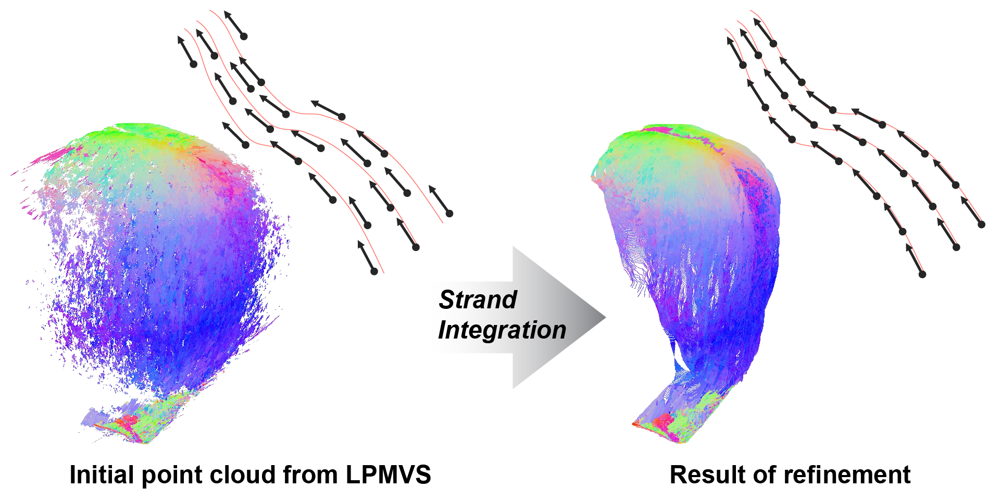

# Strand Integration

[Ryota Maeda](https://elerac.github.io/), [Kenshi Takayama](https://kenshi84.github.io/), [Takafumi Taketomi](https://taketomitakafumi.sakura.ne.jp/web/en/), "Refinement of Hair Geometry by Strand Integration", Computer Graphics Forum (PG2023), Oct. 2023.

<picture>
  <source media="(prefers-color-scheme: dark)" srcset="documents/teaser_github_dark.png">
  <source media="(prefers-color-scheme: light)" srcset="documents/teaser_github_light.png">
  
</picture>

The code will be available soon.
