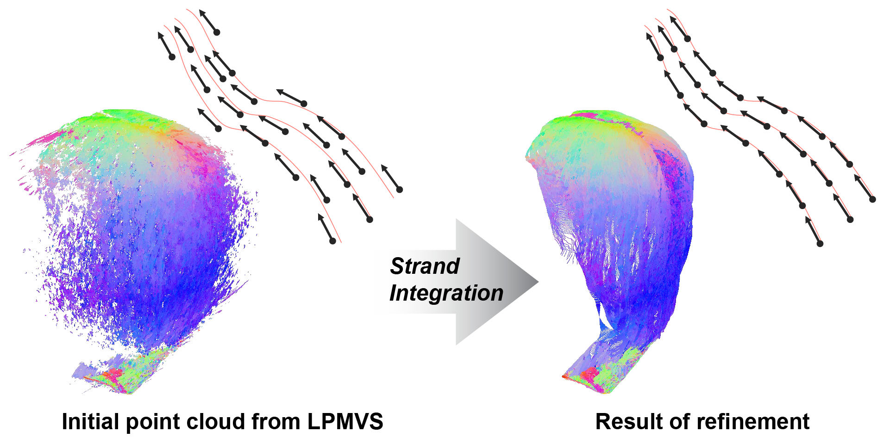

# Strand Integration (PG2023)

> [**Refinement of Hair Geometry by Strand Integration**](https://elerac.github.io/strand_integration_page),  
> Ryota Maeda, Kenshi Takayama, Takafumi Taketomi,  
> Computer Graphics Forum (PG2023)  

This repository contains the official implementation of our paper **"Refinement of Hair Geometry by Strand Integration"** (PG2023).

And also, this repository contains the unofficial implementation of **LPMVS** (Line-based PatchMatch MVS) proposed in the paper "Strand-accurate Multi-view Hair Capture" (CVPR2019).

<picture>
  <source media="(prefers-color-scheme: dark)" srcset="documents/teaser_github_dark.png">
  
</picture>

## Multi-view data

### Small-scale data

This repository contains small-scale multi-view images of straight hair for debugging our code. This data is identical to the data used in our paper except that it is resized to 1/10. You can see it in [data/straight_s](data/straight_s).

### Full-scale data

You can download the full-scale multi-view images from [release page](https://github.com/elerac/strand_integration/releases/tag/data).

## Setup

Our code requires to install the our custom Python extension implemented in C++. Please build and install it before running our code.  

```bash
cd cpp_ext
pip install .
```

For more details, please refer to [cpp_ext](cpp_ext/).


## Running

```bash
# LPMVS
python run_lpmvs.py data/straight_s -o result/lpmvs/straight_s 
# Estimate a 3D line map for each view from multi-view images.

# Run 3D line filtering (for LPMVS)
python run_line_filtering.py result/lpmvs/straight_s result/merged_ply/lpmvs/straight_s.ply
# Merge the 3D line maps into a single point cloud file.

# 3D line consistency map
python run_consistency_map.py result/lpmvs/straight_s -o result/consistency/straight_s
# Generate a 3D line consistency map described in Subsection 3.5 in our paper.

# Strand Integration
python run_strand_integration.py result/lpmvs/straight_s --consistency result/consistency/straight_s -o result/si/straight_s --views 5 --imshow
# This will only apply for view 5. You can run for all views by removing the --views option.

# 3D line filtering (for Strand Integration)
python run_line_filtering.py result/si/straight_s result/merged_ply/si/straight_s.ply
# After running all views, you can merge the results same as the above process.
```

## BibTeX

```bibtex
@article{maeda2023refinement,
    author = {Maeda, Ryota and Takayama, Kenshi and Taketomi, Takafumi},
    title = {Refinement of Hair Geometry by Strand Integration},
    journal = {Computer Graphics Forum (proceedings of Pacific Graphics)},
    volume = {42},
    number = {7},
    year = {2023}
}
```
